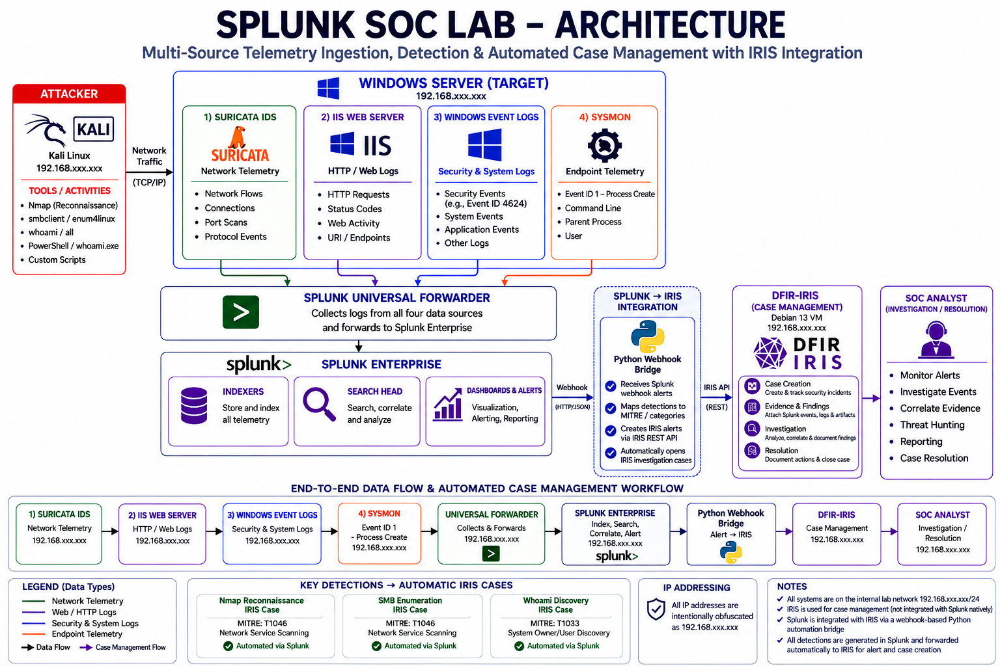

# SOC Lab Architecture

## Architecture Flow

**Suricata + IIS + Windows Event Logs + Sysmon → Splunk Universal Forwarder → Splunk Enterprise → Splunk Webhook → Python Webhook Bridge (Debian 13) → DFIR-IRIS API → IRIS Case → SOC Analyst Investigation / Resolution**

DFIR-IRIS is a separate Debian 13 case-management VM. The integration is **not a native Splunk connector**; Splunk detections are forwarded automatically through the webhook-based Python bridge, which creates an IRIS alert and escalates it into an IRIS case.

The four telemetry sources remain:
- **Suricata** — network telemetry
- **IIS** — HTTP/web-server logs
- **Windows Event Logs** — Windows Security/System telemetry
- **Sysmon** — Event ID 1 process telemetry, including command line, parent process and user

All IP addresses shown in the public diagram are intentionally obfuscated as `192.168.xxx.xxx`.

**Analyst workflow:** L1 triage/investigation → L2/L3 escalation when required → resolution.

## Actual SOC Workflow in This Lab

**Implemented workflow:**

`Splunk Detection → Automatic IRIS Alert → Automatic IRIS Case Creation → L1 SOC Triage / Investigation → Resolution`

The Splunk webhook and Python bridge automate case creation and populate the IRIS case with detection metadata, MITRE mapping and triggering-event details.

The investigation and final resolution are **not automated**. An L1 SOC analyst validates the alert, reviews available evidence, determines the outcome and resolves straightforward cases.

Where a case cannot be confidently resolved by L1, the professional escalation path is:

`L1 → L2 → L3 (if specialist/advanced analysis is required) → Resolution`

The L1/L2/L3 path describes the intended SOC operating model; the lab does not implement an automated L1/L2/L3 escalation mechanism.
